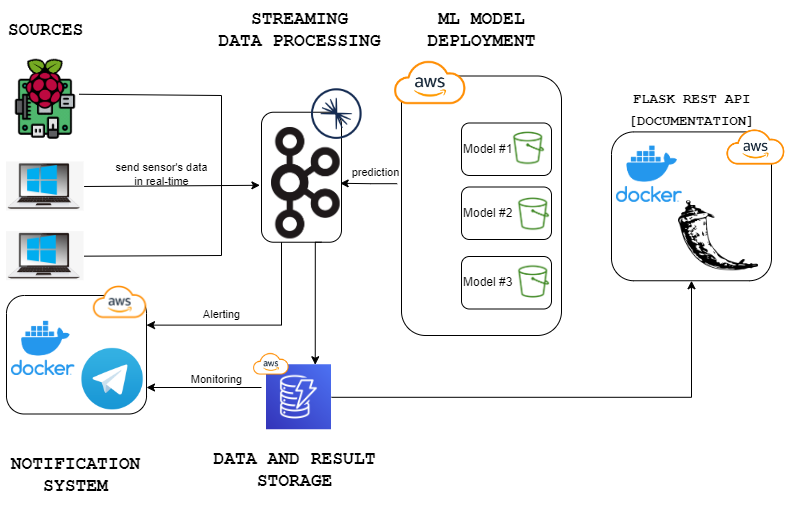

# Streaming Monitoring System

Web application (Flask based) using Swagger for documentation purposes.

Three kafka producers (two PCs and one Raspberry Pi) that will send sensor's data every 5 seconds to three different Kafka 
topics. A consumer will subscribe to this three topics, monitoring the messages by predicting in real-time the device status
and alerting the final user if one of his devices is soon to be stressed (so the user can act accordingly) based on the 
prediction of the machine learning models.
The sensor's measurements data and the predictions will be stored in `AWS DynamoDB`, accessible by the user whenever he 
requests through a bot implemented using `Telegram`. This bot serves both use cases, `alerting` and `monitoring`.

The machine learning models that predicts the status of each device are deployed in AWS S3 bucket.

Architecture of the system:

## Structure of the project

    ├── .github                     : CI/CD pipeline using GitHub Actions
    |  └── workflows                : Contains yml files that trigger the workflows in GitHub Actions.
    |       ├── docker_flask.yml 
    |       ├── docker_telegram.yml 
    |       ├── terraform.yml 
    |       └── unittests.yml 
    ├── api                         : Python Flask REST API with Swagger
    |   ├── helpers
    |   ├── tests
    |   ├── .dockerignore
    |   ├── __init__.py
    |   ├── app.py
    |   ├── Dockerfile
    |   ├── README.md
    |   └── requirements.txt 
    ├── generators                   : Sensor's data generators in real-time
    |   ├── kafkaproducer
    |   ├── raspberrypi
    |   ├── sensors
    |   ├── __init__.py
    |   ├── pc.py
    |   ├── raspberry.py
    |   └── README.md
    ├── iac                         : Infrastructure as Code 
    |   ├── .terraform
    |   ├── .gitignore
    |   ├── config.tf
    |   ├── data.tf
    |   ├── main.tf
    |   ├── outputs.tf
    |   ├── terraform.tfstate
    |   ├── terraform.tfstate.backup
    |   ├── variables.tf 
    |   └── README.md               : Further explanations on IaC part
    ├── kafkaconsumer               : Kafka Consumer
    |   ├── schemas
    |   ├── __init__.py
    |   ├── config.py
    |   ├── consumer.py
    |   ├── dynamodb.py
    |   ├── main.py
    |   ├── pc.py
    |   ├── predictor.py
    |   ├── raspberry.py
    |   └── README.md
    ├── model                        : ML Modeling
    |   ├── data
    |   ├── exported_models
    |   ├── __init__.py
    |   ├── config.py
    |   ├── data_retriever.py
    |   ├── model_pc1.py
    |   ├── model_raspberry.py
    |   ├── model_training.py
    |   └── README.md
    ├── telegrambot                  : Telegram Bot for alerting and monitoring
    |   ├── .dockerignore
    |   ├── __init__.py
    |   ├── config.py
    |   ├── Dockerfile
    |   ├── dynamodb_config.py
    |   ├── main_telegram.py
    |   ├── requirements.txt
    |   ├── utils.py
    |   └── README.md
    ├── image                       : Folder containing all the images used in the README.md files.
    ├── .env                        : File to store environment variables (not published)
    ├── .gitignore
    ├── README.md
    ├── requirements.txt            : File containing the library requirements to run the project locally
    └── setup.py                    : Setup python file of the project

**Refer to each section `README.md` file for further details.**

All folders contain its own `README.md` file with further explanations except `.github` folder which is the one 
containing the CI/CD pipeline workflows triggered by GitHub Actions on every push to any branch or pull request (PR) to 
the main branch. There are three different workflows configured, using GitHub secrets for security reasons when pushing 
the code, that will be triggered one after the other:

### unittests.yml

First workflow triggered. It executes the tests defined for the main application in `api > tests`.

### docker_flask.yml

If the first workflow (`unittests.yml`) is successful, this workflow is triggered. It builds and pushes the docker 
image of the main application to the Docker Hub Registry.

### docker_telegram.yml

This workflow is triggered at the same time `unittests.yml` workflow since they're independent. It builds and pushes the docker 
image of the telegram bot application to the Docker Hub Registry.

### terraform.yml

If the docker_flask workflow (`docker_flask.yml`) is successful, this workflow is triggered. It deploys on AWS the 
main application using terraform. It saves the state of the application everytime terraform is applied and redeployed, 
so it only redeploys the changes, if any. This makes the deployment faster.

## Table reference of the sensors' measure values

| Sensor Type | Measure                       |
|-------------|-------------------------------|
| Temperature | `ºC (Celsius)`                |
| Power       | `W (Watt)`                    |
| Load        | `% (percentage)`              |
| Voltage     | `V (Volt)`                    | 
| Fan         | `CFM (Cubic Feet per Minute)` | 
| Clock       | `GHz (GigaHertz)`             |

## Environmental Variables

| Variable                | Description                                                                 |
|-------------------------|-----------------------------------------------------------------------------|
| `KAFKA_CLUSTER_KEY`     | Confluent Cloud Cluster Key                                                 |
| `KAFKA_CLUSTER_SECRET`  | Confluent Cloud Cluster Secret                                              |
| `KAFKA_BROKER_SETTINGS` | Confluent Cloud Cluster Endpoint                                            |
| `KAFKA_SCHEMA_ENDPOINT` | Confluent Cloud Schema Registry Endpoint                                    |
| `SCHEMA_USERNAME`       | Confluent Cloud Schema Registry Key                                         |
| `SCHEMA_PASSWORD`       | Confluent Cloud Schema Registry API Secret                                  |
| `TOPIC_NAME`            | Topic name to produce records to Kafka                                      |
| `AWS_ACCESS_KEY`        | AWS Access Key to deploy the Flask REST API to                              |
| `AWS_SECRET_ACCESS_KEY` | AWS Secret Access Key to deploy the Flask REST API to                       |
| `DOCKER_HUB_USERNAME`   | Docker Hub registry username (to build and publish docker image of the app) |
| `DOCKER_HUB_TOKEN`      | Docker Hub registry Token (to build and publish docker image of the app)    |
| `TF_CLOUD_TOKEN`        | Terraform Cloud Token to automate the deployment in AWS                     |
| `DEVICE`                | Device from where you are running the application [`RASPBERRY`, `PC`]       |

