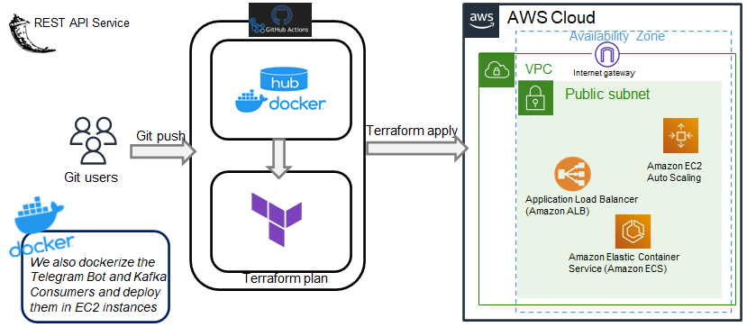

# Flask REST API using Swagger

This Flask API was developed for documenting purposes. It uses AWS DynamoDB as the database and defines each of the
devices as models. 

Under the `operations` tab it's possible to make requests to the database and retrieve all documents in the database 
(sensor related data), documents for `pc1` device, documents for `pc2` device, documents for `raspberry` device or any
of their statuses, meaning for status as the latest prediction made to the chosen device on whether the device is 
burning out/throttling or not.

This Flask application is `Dockerized` and deployed in `AWS ECS` using also an `Application Load Balancer` for the web
to be available everywhere. Have a look at `iac` folder `README.md` file for further information about the deployment 
of the web using `Terraform`.

**Deployment architecture:**




## Table reference of the sensors' measure values

| Sensor Type | Measure                       |
|-------------|-------------------------------|
| Temperature | `ºC (Celsius)`                |
| Power       | `W (Watt)`                    |
| Load        | `% (percentage)`              |
| Voltage     | `V (Volt)`                    | 
| Fan         | `CFM (Cubic Feet per Minute)` | 
| Clock       | `GHz (GigaHertz)`             | 


## Run Flask API using Docker

Download image:

```shell
  docker pull -t escobarana/sensorsapi:latest
```

Run image:

```shell
  docker run -p 5000:5000 -t -i escobarana/sensorsapi:latest --env-file .env
```


## Run Flask API locally

`OpenHardwareMonitor` software must be running before launching the instance. 
*https://openhardwaremonitor.org/*

Install prerequisites (if the `requirements.txt` installation fails see *Notes section for further details):

```shell
  pip install -r requirements.txt
```

Run tests

```shell
  cd api
```

```shell
  python -m unittest tests/__init__.py
```

Run Flask REST API

```shell
  cd api
```

```shell
  python app.py
```


## *Notes

The `WMI` library only works in Windows OS, if you're running the code in any other OS use the `Raspberry Pi` 
configuration, comment this library in the `requirements.txt` file.


When working with an OS different than Windows (with `aarch64`), to install `confluent-kafka` library you might 
encounter some incompatibility errors since they do not provide prebuilt binary wheels for `aarch64`. You will need to 
compile it yourself, which requires to first build and install `librdkafka` from source. Follow this steps:

```shell
    sudo apt-get install -y libssl-dev zlib1g-dev gcc g++ make
    git clone https://github.com/edenhill/librdkafka
    cd librdkafka
    ./configure --prefix=/usr
    make
    pip install confluent-kafka
```

If after this installation you try to run the code and get the following error: `Undefined Symbol: rd_kafka_producev` 
it is most likely because you have an earlier version installed in `/usr` and the newest version you just installed is
located in `/usr/local` and it will not be picked up automatically. 
You can check it by running `sudo apt-get purge librdkafka1 librdkafka-dev`.

To solve this issue you have to remove the previous versions from the deb package:

```shell
  sudo apt-get purge librdkafka1 librdkafka-dev
```
